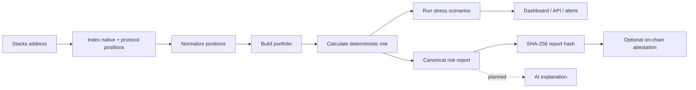
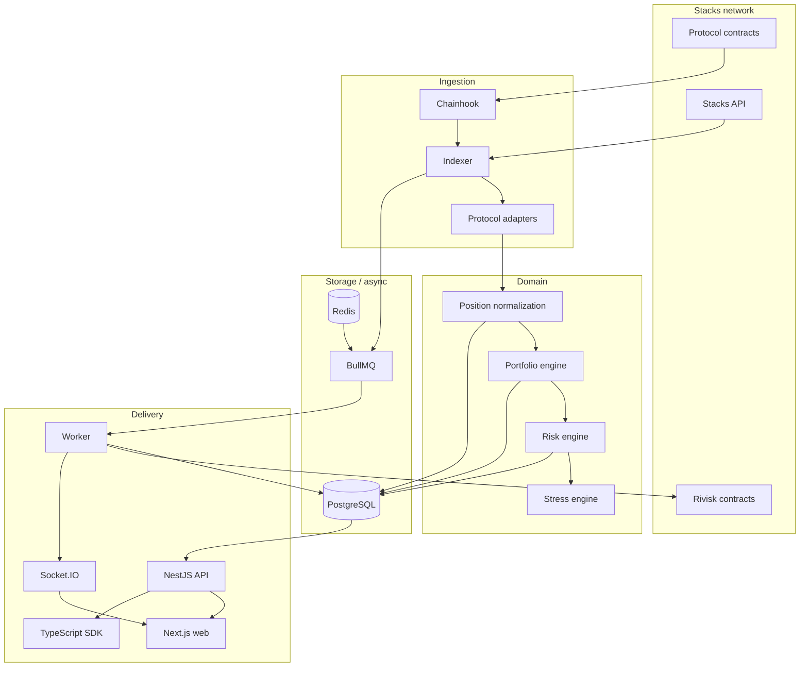

# Rivisk

**Risk intelligence, portfolio observability and verifiable risk attestations for Bitcoin capital on Stacks.**

Rivisk is a non-custodial platform for understanding how capital is deployed across Stacks applications. It indexes wallet and protocol positions, converts them into a common portfolio model, calculates deterministic risk metrics, runs stress scenarios, evaluates alerts, and can anchor compact risk attestations on-chain through Clarity contracts.

The project is being built for users who need more than a balance screen. A wallet may hold sBTC directly while also having capital in a streaming contract, a lending market, a liquidity position or another protocol. Rivisk is designed to answer portfolio-level questions across those boundaries.

> Rivisk observes and explains risk. It does not hold user funds, execute trades, or make investment decisions for the user.

## Live beta (Stacks testnet)

| | |
| --- | --- |
| App and docs | https://rivisk-lilac.vercel.app · [dashboard](https://rivisk-lilac.vercel.app/dashboard) · [/docs](https://rivisk-lilac.vercel.app/docs) |
| REST API | https://api.13.49.129.179.sslip.io/api/v1 · [interactive reference](https://api.13.49.129.179.sslip.io/docs) |
| Realtime | `wss://ws.13.49.129.179.sslip.io` |
| Contracts | `ST2F3J1PK46D6XVRBB9SQ66PY89P8G0EBDW5E05M7` · [`risk-registry`](https://explorer.hiro.so/txid/ST2F3J1PK46D6XVRBB9SQ66PY89P8G0EBDW5E05M7.risk-registry?chain=testnet) (see `contracts/deployments/testnet.json`) |
| SDK | [`@rivisk/sdk`](https://www.npmjs.com/package/@rivisk/sdk) on npm |

**Beta infrastructure:** the backend runs on a small AWS deployment currently covered by temporary promotional credits, with no production SLA. Sustainable hosting is [grant work](#what-this-grant-funds).

The dashboard has a page per section — overview, positions, stress tests, alerts, risk policy and developer settings — each linkable with `?address=`.

Indexing a wallet publishes a risk attestation to the testnet registry (throttled to changes, or once per 120 blocks), and Chainhook confirms each one back into the API. What is and isn't proven is in [the status page](https://rivisk-lilac.vercel.app/docs/status). Hosting: [documentation/37-aws-beta-deployment.md](./documentation/37-aws-beta-deployment.md).

---

## Why Rivisk exists

As more Bitcoin-linked capital becomes usable on Stacks, a single address can have several different kinds of exposure at the same time. Each protocol naturally shows its own state, but the user owns the combined portfolio.

That creates questions that are difficult to answer from one protocol interface:

- Where is my sBTC actually deployed?
- How much capital is liquid now, and how much is locked or committed?
- Which protocol represents my largest concentration?
- How healthy are my collateralized positions?
- How far is a supported position from liquidation?
- What happens to the portfolio under a 10%, 20% or 30% BTC decline?
- Is the displayed value realistically exit-able without large price impact?
- Can another wallet, treasury tool or application consume the same risk data without rebuilding the entire indexing stack?

Rivisk is being built as the shared layer between protocol-specific state and those portfolio-level questions.

---

## What the product does

At a high level, Rivisk follows this flow:



**The planned AI layer sits at the end of that chain, never in the middle.** Rivisk will add an optional explanation layer on top of the deterministic risk engine: it reads the finished structured report and explains, in plain language, what is driving a wallet's risk, what changed and what a stress scenario means. It does not calculate risk, discover positions or replace any formula, and nothing it produces is ever hashed or published on chain. Every number stays reproducible from the report hash with the explainer switched off. It is [Milestone 2 grant work](./documentation/22-grant-milestones.md), not something the beta ships today.

The same normalized portfolio drives the web application, API, SDK, alerts and risk reports. That is intentional: there should not be one set of calculations for the dashboard and another hidden implementation for developers.

### Core capabilities

The grant/MVP work is centered on:

- Stacks wallet indexing;
- sBTC and SIP-010 position discovery;
- protocol adapters;
- normalized cross-protocol positions;
- portfolio aggregation;
- protocol and asset concentration;
- capital accessibility/locked-capital analysis;
- collateral health and liquidation metrics for supported protocols;
- liquidity analysis where reliable market data exists;
- BTC and custom stress scenarios;
- threshold alerts;
- realtime updates;
- developer API and TypeScript SDK;
- signed developer webhooks;
- on-chain risk attestations;
- user-owned on-chain risk policies;
- on-chain protocol registry metadata.

---

## Project principles

### Non-custodial

Rivisk does not need custody of user assets to analyze them. The normal product path never asks for a seed phrase or raw private key.

### Deterministic before intelligent

Risk calculations live in ordinary, testable code. An AI explanation layer may translate structured results into plain language later, but it does not invent or calculate the underlying risk metrics.

### Explain the number

Important risk values should be traceable to:

- source protocol;
- source block;
- observed position state;
- pricing source/time;
- methodology/engine version.

### Prefer missing data to false precision

If Rivisk cannot calculate a value reliably, the product should return `unavailable`, `stale` or a warning rather than a confident-looking guess.

### Protocols plug in; the risk engine stays protocol-agnostic

Protocol-specific logic belongs in adapters. Once a position is normalized, portfolio and risk code should not need special BitPay/lending/DEX branches spread throughout the application.

### Keep the first system operationally sane

Rivisk is enterprise-shaped without intentionally over-engineering the grant MVP. We use strong package boundaries, queues, observability, tests and containerized services, but we are not starting with Kafka, Kubernetes or a service mesh simply for appearance.

---

## Architecture

Rivisk is a TypeScript monorepo with five deployable application processes and shared domain packages.



### Separation of responsibilities

- **Indexer:** understands Stacks data, blocks, events and refreshes.
- **Protocol adapters:** understand individual protocol state.
- **Portfolio engine:** understands normalized positions and aggregation.
- **Risk engine:** understands deterministic risk calculations.
- **Worker:** owns retryable asynchronous side effects and calculations.
- **API:** understands HTTP clients, validation, auth and public contracts.
- **Realtime service:** delivers live update signals.
- **Clarity contracts:** provide verifiability, user-owned policies and composability.

The risk engine should not query the database. The adapter should not send email. The API should not contain the only implementation of a financial formula. Those boundaries are intentional.

---

## Repository layout

```text
rivisk/
├── apps/
│   ├── web/                    Next.js dashboard
│   ├── api/                    NestJS REST API
│   ├── indexer/                Stacks + Chainhook indexing process
│   ├── worker/                 BullMQ jobs and asynchronous processors
│   └── realtime/               Socket.IO gateway
│
├── packages/
│   ├── adapter-core/           ProtocolAdapter + NormalizedPosition contract
│   ├── adapter-native-stacks/  Native STX/SIP-010 wallet positions
│   ├── adapter-bitpay/         BitPay streaming positions
│   ├── portfolio-engine/       Protocol-independent portfolio aggregation
│   ├── risk-engine/            Deterministic risk and stress primitives
│   ├── stacks/                 Typed Stacks API/read helpers
│   ├── oracle/                 Price-source abstraction
│   ├── database/               Prisma schema/client
│   ├── events/                 Typed domain events
│   ├── queue/                  BullMQ/Redis helpers
│   ├── rivisk-contracts/     TypeScript client for Rivisk Clarity contracts
│   ├── sdk/                    Public TypeScript SDK
│   ├── shared-types/           Shared domain types
│   ├── validation/             Shared validation helpers
│   └── logger/                 Structured logging
│
├── contracts/                  Clarinet project + Clarity contracts/tests
├── chainhook/                  Chainhook predicates and notes
├── docs/                       Short architecture notes and ADRs
├── documentation/              Full product + engineering documentation
├── infrastructure/             Docker/Terraform infrastructure
├── scripts/                    Developer/operational scripts
└── .github/                    CI, security and contribution automation
```

For a full explanation of what belongs where, see [Repository structure](./documentation/06-repository-structure.md).

---

## Technology stack

| Area | Technology |
| --- | --- |
| Runtime | Node.js 22+ |
| Language | TypeScript 5.9 |
| Monorepo | pnpm 10 + Turborepo |
| Web | Next.js 16, React 19, TanStack Query, Stacks Connect |
| API | NestJS 11, REST, OpenAPI/Swagger |
| Database | PostgreSQL 16, Prisma 6 |
| Queue/cache | Redis 7.4, BullMQ |
| Blockchain | Stacks API, Stacks.js, Chainhook |
| Contracts | Clarity, Clarinet SDK |
| Numeric math | `bigint`, decimal strings, Decimal.js |
| Realtime | Socket.IO |
| Tests | Vitest, Jest/Supertest, Clarinet SDK, Playwright-ready |
| CI/CD | GitHub Actions |
| Infrastructure | Docker Compose, Terraform scaffold |
| Observability | structured logging, OpenTelemetry/Sentry-ready |

Why these choices were made is documented in [Technology stack](./documentation/07-technology-stack.md) and [Architecture decisions](./documentation/30-decisions-and-tradeoffs.md).

---

## Protocol adapter model

Every protocol integration implements a shared interface.

```ts
export interface ProtocolAdapter {
  metadata(): ProtocolMetadata;
  supports(address: string, context: AdapterContext): Promise<boolean>;
  getPositions(
    address: string,
    context: AdapterContext,
  ): Promise<NormalizedPosition[]>;
}
```

A normalized position can represent wallet balances, streams, lending/borrowing positions, LP positions, staking positions or vault exposure without forcing the risk engine to know how the original protocol stores its data.

Current adapter work:

- native Stacks adapter: live STX/SIP-010 balance indexing with token metadata and accessibility data;
- BitPay stream adapter: direct contract reader plus normalized locked/withdrawable sBTC positions;
- Zest V2 adapter: first external lending integration, including obligation reads, zToken-to-underlying conversion, scaled-debt normalization and protocol LTV/liquidation parameters.

The Zest adapter is disabled by default and is meant to be enabled deliberately after network configuration. Mainnet defaults track the current public Zest V2 deployment, while testnet/devnet require explicit contract overrides.

See [Protocol adapter design](./documentation/09-protocol-adapter-design.md).

---

## Risk engine

The deterministic risk engine is a pure package. It does not fetch HTTP data, call Prisma or sign Stacks transactions.

The current implementation includes:

- protocol concentration based on gross exposure;
- asset concentration;
- capital accessibility;
- lending LTV and borrow headroom;
- health-factor classification against adapter-supplied liquidation thresholds;
- liquidation distance and single-collateral liquidation-price estimates;
- deterministic BTC/STX and custom multi-asset price shocks;
- versioned risk reports with standard stress results;
- a transparent MVP composite score that remains secondary to the underlying metrics.

Policy-driven alerts are now implemented. Still planned for the grant work are market-depth exit/liquidity analysis, more protocol-native pricing where execution-level parity matters, and additional adapters.

### Numeric conventions

Rivisk avoids JavaScript floating-point values for token quantities and money where precision matters.

- atomic token values: strings / `bigint`;
- USD math: Decimal.js / PostgreSQL Decimal;
- percentages in contracts/events: basis points (`10,000 = 100%`);
- health factor: E4 fixed point (`14,700 = 1.4700`).

See [Risk engine methodology](./documentation/10-risk-engine-methodology.md).

---

## Stress testing

The built-in user-facing scenarios are:

```text
BTC -10%
BTC -20%
BTC -30%
STX -20%
```

Custom multi-asset shocks are implemented as well. The scenario engine copies the latest normalized positions, applies the requested price changes, recalculates values and lending metrics, and reports before/after health and liquidation distance. It can flag positions that cross the partial-liquidation threshold under the scenario.

The API exposes:

```text
GET  /api/v1/simulations/presets
POST /api/v1/simulations
GET  /api/v1/alerts/{address}
POST /api/v1/alerts/{address}
PATCH /api/v1/alerts/{alertId}
GET  /api/v1/policies/{address}
```

A simulation runs against the latest persisted portfolio snapshot so the source block is known. It is a what-if calculation, not a market prediction, and it never executes a real transaction.

See [Stress testing](./documentation/11-stress-testing.md) and [Zest V2 lending + stress implementation](./documentation/32-zest-v2-lending-and-stress-engine.md).

---

## Smart contracts

Rivisk keeps financial analysis off-chain and uses Clarity for the parts that benefit from public state and verification.

### `risk-provider-trait.clar`

Defines the minimal composable risk-provider interface.

### `risk-registry.clar`

Stores historical wallet risk snapshots containing compact metrics, source block and a SHA-256 report hash. Only authorized publishers can create snapshots.

### `risk-policy.clar`

Lets a wallet store its own small risk-threshold policy on-chain. The off-chain worker evaluates that policy and handles notifications.

### `protocol-registry.clar`

Records supported protocol contract principals, adapter versions and metadata hashes.

The contracts do **not** hold user funds.

```text
Full risk report
      │
      ▼
Canonical serialization
      │
      ▼
SHA-256
      │
      ├──────────────> full report stored off-chain
      │
      ▼
risk-registry.clar
(summary + source block + hash)
```

See [Smart contract design](./documentation/12-smart-contract-design.md) and [On-chain attestations](./documentation/13-onchain-attestations.md).

---

## Existing Stacks work we can leverage

Rivisk deliberately builds on lessons and reusable patterns from earlier Stacks projects instead of rewriting infrastructure for no reason.

### StacksPay patterns

Useful patterns include:

- Stacks API integration;
- Chainhook/event processing;
- API key architecture;
- outbound webhooks;
- SDK organization;
- Swagger/OpenAPI;
- security middleware.

### BitPay patterns

Useful pieces include:

- sBTC/Clarity reads;
- contract-event indexing;
- realtime update patterns;
- stream state;
- Clarity administration patterns.

BitPay can also be a real Rivisk adapter: a stream is a protocol position whose remaining sBTC may be partly accessible and partly locked/vesting.

We do **not** copy merchant checkout, payment-link, marketplace, custody or unrelated treasury execution logic into Rivisk.

See [Existing code reuse](./documentation/21-existing-code-reuse.md).

---

## Data model

The PostgreSQL/Prisma model is snapshot-oriented rather than current-state-only.

Key entities include:

- `User`;
- `Wallet`;
- `Protocol`;
- `Position`;
- `PositionAsset`;
- `PositionSnapshot`;
- `PortfolioSnapshot`;
- `RiskSnapshot`;
- `AlertRule`;
- `AlertEvent`;
- `ApiKey`;
- `WebhookEndpoint`;
- `WebhookDelivery`;
- `IndexedBlock`;
- `AuditLog`.

Historical snapshots matter because an old on-chain report hash needs to remain connected to the exact state that produced it.

See [Data model](./documentation/08-data-model.md).

---

## API and SDK direction

Public API resources are versioned under `/api/v1`.

Current implemented portfolio, simulation, alert and policy resources include:

```text
GET  /api/v1/portfolios/{address}
POST /api/v1/portfolios/{address}/refresh
GET  /api/v1/portfolios/{address}/risk
GET  /api/v1/simulations/presets
POST /api/v1/simulations
GET  /api/v1/alerts/{address}
POST /api/v1/alerts/{address}
PATCH /api/v1/alerts/{alertId}
GET  /api/v1/policies/{address}
```

Authenticated email/webhook delivery and API-key management are implemented; see [current status](./documentation/29-current-status.md) for exactly how far each has been proven. Dedicated positions/protocol endpoints are still planned. Simulation history may be added later; the current custom simulation endpoint is stateless and runs against the latest persisted portfolio snapshot.

The SDK should remain a thin typed client over these resources rather than reimplementing business logic.

Developer webhooks are signed (`rivisk-signature`, Stripe-style `t=,v1=` HMAC), retried with backoff, and stored with delivery history.

See [API, SDK and webhooks](./documentation/15-api-sdk-and-webhooks.md).

---

## Realtime and alerts

Socket.IO is used to tell connected clients that portfolio/risk state changed. Alert rules are evaluated separately after new risk snapshots.

Initial alert examples:

```text
healthFactor < 1.30
protocolConcentrationBps > 5000
liquidityScoreBps < 4000
riskScoreBps > 7000
```

The alert evaluator is edge-triggered: a rule fires when a metric crosses into a breach and does not fire again on every subsequent snapshot while it stays breached. Authenticated delivery preferences are implemented, including a per-user email opt-out and database-enforced send deduplication. Longer cooldown controls are still planned.

See [Realtime updates and alerts](./documentation/16-realtime-and-alerts.md).

---

## Current implementation status

Everything below is one of three things: **live** (running in the beta and checked against real chain or protocol state), **built** (implemented and tested, but never proven end to end), or **not built**. The same breakdown, per capability, is on the [status page](https://rivisk-lilac.vercel.app/docs/status) and in [29-current-status.md](./documentation/29-current-status.md).

### Live in the beta

- **Indexing:** native Stacks balances (STX and SIP-010, including sBTC), read at a named block and matched against the chain to the last micro-STX.
- **Portfolio and risk:** normalized positions, net equity, per-protocol and per-asset totals, concentration, capital accessibility, health factor and liquidation distance, all deterministic and integer-only.
- **Stress testing:** BTC −10/−20/−30, STX −20 and custom multi-asset shocks.
- **Zest V2 lending adapter:** validated against a real mainnet obligation, reproducing the protocol's own debt figure to eight significant figures. Off in the testnet beta, where Zest does not exist.
- **Clarity contracts:** `risk-provider-trait`, `risk-registry`, `risk-policy`, `protocol-registry` and a reference consumer, deployed to testnet.
- **On-chain attestations:** the worker publishes a snapshot whose report hash matches the API, throttled to real changes or one per 120 blocks (`ATTESTATION_MIN_INTERVAL_BLOCKS`), so public traffic cannot drain the publisher.
- **External consumption:** `risk-consumer-example` reads a snapshot through the trait and approves or rejects a position.
- **Chainhook 2.0:** registered on testnet; a new attestation's on-chain snapshot id is recorded back into the API seconds after it is mined, and rollbacks clear it.
- **API, auth and credentials:** wallet-signature sessions, API keys (`rv_live_`/`rv_test_`) accepted for alerts and webhooks and refused for key management, per-IP rate limiting with `Retry-After`.
- **Realtime:** Socket.IO over WSS; a refresh reaches a subscribed browser in about two seconds.
- **Signed webhooks:** HMAC-signed delivery with retry backoff.
- **Dashboard and docs site:** wallet or read-only address inspection, live updates, and 13 documentation pages with search.
- **SDK:** [`@rivisk/sdk`](https://www.npmjs.com/package/@rivisk/sdk), zero-dependency and isomorphic.

### Built, not yet proven

- **BitPay stream adapter:** the reader matches `bitpay-core`'s interface, but no BitPay contract exists on the current testnet, so it stays disabled — see [29-current-status.md](./documentation/29-current-status.md).
- **Browser transaction flow for `risk-policy`:** implemented; not yet exercised with a real wallet.
- **Email delivery:** implemented; no SMTP server is configured in the beta.

### Not built

- email address verification;
- market-depth liquidity (today's score measures capital accessibility, and is labelled as such);
- mainnet deployment of the contracts, which follows the independent review ([what depends on the review](#what-depends-on-the-review));
- a hosted public API with its own terms: the beta is a single server, and self-hosting is documented.

---

## Local development

### Prerequisites

- Node.js 22+
- Docker
- Clarinet for smart-contract development
- Git

### Install

```bash
corepack enable
corepack prepare pnpm@10.17.1 --activate
pnpm install
```

### Configure

```bash
cp .env.example .env
```

Do not use real production secrets in the local `.env` file.

### Start PostgreSQL and Redis

```bash
pnpm infra:up
```

### Prisma

```bash
pnpm db:generate
pnpm db:migrate
pnpm db:seed
```

### Run the workspace

```bash
pnpm dev
```

Default local endpoints:

| Service | URL |
| --- | --- |
| Web | `http://localhost:3000` |
| API | `http://localhost:4000/api/v1` |
| Swagger | `http://localhost:4000/docs` |
| Realtime | `http://localhost:4001` |
| PostgreSQL | `localhost:5432` |
| Redis | `localhost:6379` |

### Quality checks

```bash
pnpm format:check
pnpm lint
pnpm typecheck
pnpm test
pnpm build
```

### Contracts

```bash
cd contracts
pnpm install
pnpm test
clarinet check
```

See [Local development](./documentation/24-local-development.md) for troubleshooting and targeted commands.

---

## Environment variables

The root `.env.example` documents the current configuration surface.

Main groups:

```text
Core                 NODE_ENV, ports, URLs
Persistence          DATABASE_URL, REDIS_URL
Stacks               network, API URL/key, Chainhook auth
Contracts            deployed Rivisk contract principals
Publisher            enable flag + publisher secret
Auth                  JWT secret + API-key pepper
Notifications         SMTP configuration
Observability         Sentry / OTLP endpoints
```

The publisher private key must use a secret manager in production and should not live in the API process.

---

## Security model

The baseline security posture includes:

- non-custodial architecture;
- no seed/private-key collection from users;
- wallet challenge authentication for saved account actions;
- hashed developer API keys;
- signed webhooks;
- authenticated Chainhook ingress;
- input validation at boundaries;
- Helmet/CORS/rate limiting;
- idempotent blockchain event processing;
- isolated attestation publisher;
- structured audit logs;
- dependency/static analysis in CI;
- explicit stale/missing-data behavior.

See [Security model](./documentation/17-security-model.md).

---

## Testing

Rivisk uses different test layers for different failure modes:

- pure risk/portfolio unit tests;
- adapter fixture tests;
- Clarinet contract tests;
- PostgreSQL/Redis integration tests;
- NestJS/Supertest API tests;
- worker/idempotency/retry tests;
- Playwright end-to-end user flows;
- controlled Stacks testnet/mainnet smoke tests.

Financial formula boundaries, auth checks, event idempotency and report-hash reproducibility deserve more attention than a superficial coverage percentage.

See [Testing strategy](./documentation/18-testing-strategy.md).

---

## Observability

Production services should expose health/readiness and structured metrics. Important signals include:

```text
indexer_lag_blocks
wallet_refresh_duration_ms
adapter_failures_total
risk_calculation_duration_ms
queue_depth
queue_job_failures_total
alerts_triggered_total
webhook_delivery_failures_total
attestation_publish_failures_total
```

Data freshness is itself an operational metric. An API can be technically "up" while serving stale portfolio state, so source block and freshness need first-class monitoring.

See [Observability and operations](./documentation/19-observability-and-operations.md).

---

## Grant delivery plan

### What exists today — self-funded, not grant scope

A public beta, built before applying: the [hosted beta](#live-beta-stacks-testnet) (web app on Vercel, backend on AWS, currently running on **temporary promotional credits**), five Clarity contracts deployed to Stacks testnet, live risk attestations with Chainhook confirming each snapshot id, [`@rivisk/sdk`](https://www.npmjs.com/package/@rivisk/sdk) on npm, wallet-signature authentication, API keys, signed webhooks, realtime updates, and a Zest V2 adapter validated against a real mainnet obligation. Evidence per capability: [status page](https://rivisk-lilac.vercel.app/docs/status) · [29-current-status.md](./documentation/29-current-status.md).

### What this grant funds

| Milestone | Focus | Amount | Target |
| --- | --- | --- | --- |
| 1 | **Beta hardening and infrastructure review** — the credits covering the beta expire, so: architecture review, sustainable paid hosting, persistent database with tested backups *and restores*, monitoring, an exercised recovery procedure, attestation-path reliability, threat model, and the independent contract review commissioned | $2,000 | 14 Oct 2026 |
| 2 | **Advanced risk intelligence and AI explanations** — market-depth and exit-risk modelling to replace the accessibility proxy, plus an optional AI layer that explains a finished report in plain language (including $200–$300 of model cost) | $3,000 | 11 Nov 2026 |
| 3 | **Ecosystem integration and production readiness** — one real external Stacks project integrating, the independent review delivered and its findings fixed, published API terms, versioning and usage metrics, and the reviewed contracts released to mainnet | $5,000 | 2 Dec 2026 |

| Milestone | Engineering | Infrastructure and external costs | Total |
| --- | --- | --- | --- |
| 1 | $1,100 architecture and hardening | $600 hosting · $300 monitoring and backups | $2,000 |
| 2 | $2,300 risk depth and AI implementation | $200 model usage · $500 market data and testing | $3,000 |
| 3 | $2,200 integration and release work | $1,200 independent review · $1,100 production infrastructure · $500 validation and docs | $5,000 |

### What depends on the review

Mainnet is **part of the grant path, not vague future work** — but it is earned, not assumed. The testnet contracts are a working beta deployment, not a finished design, and a Clarity contract cannot be edited in place:

```text
testnet v1 (today) → independent review → fix findings → redeploy to testnet if the
code changed → revalidate → mainnet, if no blocking finding remains
```

If a blocking issue prevents the mainnet release, the finding and its remediation get documented rather than shipping an unsafe contract to meet a date.

Deliverables and acceptance criteria per milestone: [Grant milestones](./documentation/22-grant-milestones.md). The same today-versus-next table is on the site at [/docs/grant-scope](https://rivisk-lilac.vercel.app/docs/grant-scope).

---

## Documentation

The long-form documentation is intentionally comprehensive and written so a new contributor can understand the project without needing the original design conversation.

Start at [documentation/README.md](./documentation/README.md).

| Topic | Document |
| --- | --- |
| Product overview | [01-product-overview.md](./documentation/01-product-overview.md) |
| Full PRD | [02-product-requirements.md](./documentation/02-product-requirements.md) |
| Users/use cases | [03-users-and-use-cases.md](./documentation/03-users-and-use-cases.md) |
| Scope/non-goals | [04-scope-and-non-goals.md](./documentation/04-scope-and-non-goals.md) |
| System architecture | [05-system-architecture.md](./documentation/05-system-architecture.md) |
| Repository layout | [06-repository-structure.md](./documentation/06-repository-structure.md) |
| Technology choices | [07-technology-stack.md](./documentation/07-technology-stack.md) |
| Data model | [08-data-model.md](./documentation/08-data-model.md) |
| Protocol adapters | [09-protocol-adapter-design.md](./documentation/09-protocol-adapter-design.md) |
| Risk methodology | [10-risk-engine-methodology.md](./documentation/10-risk-engine-methodology.md) |
| Stress testing | [11-stress-testing.md](./documentation/11-stress-testing.md) |
| Smart contracts | [12-smart-contract-design.md](./documentation/12-smart-contract-design.md) |
| Attestations | [13-onchain-attestations.md](./documentation/13-onchain-attestations.md) |
| Chainhook/indexing | [14-chainhook-and-indexing.md](./documentation/14-chainhook-and-indexing.md) |
| API/SDK/webhooks | [15-api-sdk-and-webhooks.md](./documentation/15-api-sdk-and-webhooks.md) |
| Realtime/alerts | [16-realtime-and-alerts.md](./documentation/16-realtime-and-alerts.md) |
| Security | [17-security-model.md](./documentation/17-security-model.md) |
| Testing | [18-testing-strategy.md](./documentation/18-testing-strategy.md) |
| Operations | [19-observability-and-operations.md](./documentation/19-observability-and-operations.md) |
| Deployment | [20-deployment-and-infrastructure.md](./documentation/20-deployment-and-infrastructure.md) |
| Existing-code reuse | [21-existing-code-reuse.md](./documentation/21-existing-code-reuse.md) |
| Grant milestones | [22-grant-milestones.md](./documentation/22-grant-milestones.md) |
| Roadmap | [23-roadmap.md](./documentation/23-roadmap.md) |
| Local setup | [24-local-development.md](./documentation/24-local-development.md) |
| Engineering workflow | [25-engineering-workflow.md](./documentation/25-engineering-workflow.md) |
| Project risks | [26-risks-and-mitigations.md](./documentation/26-risks-and-mitigations.md) |
| Demo/acceptance plan | [27-demo-and-acceptance-plan.md](./documentation/27-demo-and-acceptance-plan.md) |
| Glossary | [28-glossary.md](./documentation/28-glossary.md) |
| Current status | [29-current-status.md](./documentation/29-current-status.md) |
| Milestone 1 implementation | [31-milestone-1-implementation.md](./documentation/31-milestone-1-implementation.md) |
| Zest V2 lending + stress implementation | [32-zest-v2-lending-and-stress-engine.md](./documentation/32-zest-v2-lending-and-stress-engine.md) |
| Dashboard + alerts + policy evaluation | [33-dashboard-alerts-and-policy-evaluation.md](./documentation/33-dashboard-alerts-and-policy-evaluation.md) |
| Decisions/trade-offs | [30-decisions-and-tradeoffs.md](./documentation/30-decisions-and-tradeoffs.md) |

The shorter `docs/` directory remains available for concise architecture notes and ADRs.

---

## Contributing

Read [CONTRIBUTING.md](./CONTRIBUTING.md) and [Engineering workflow](./documentation/25-engineering-workflow.md).

A normal change should pass:

```bash
pnpm format:check
pnpm lint
pnpm typecheck
pnpm test
pnpm build
```

Contract changes also need:

```bash
cd contracts
pnpm test
clarinet check
```

Protocol adapter changes should include fixtures and document how values are derived from protocol state.

---

## Security

Please read [SECURITY.md](./SECURITY.md) and the full [Security model](./documentation/17-security-model.md).

Do not open a public issue containing credentials, exploitable private details or a live publisher secret.

---

## License

See [LICENSE](./LICENSE).

---

## Project status

Rivisk is under active development. The repository currently provides the architecture, contract foundation and first domain primitives needed for the grant milestones. Public beta/mainnet readiness should be judged by the explicit status and acceptance criteria in the documentation rather than by the presence of folders alone.
