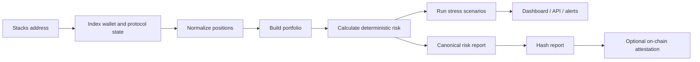

# Product Overview

## What RiskRail is

RiskRail is a non-custodial risk intelligence layer for Bitcoin capital used on Stacks.

The simple idea is that a wallet should not have to visit five different applications to understand where its capital is, how much of that capital is immediately accessible, which protocols it depends on, how close a collateralized position is to liquidation, or what a sharp BTC move could do to the portfolio.

RiskRail reads public on-chain state, normalizes positions from supported protocols, values those positions using clearly identified market data, calculates deterministic risk metrics, and presents the result through a dashboard and an API. It can also commit compact risk attestations to Clarity contracts so a report can be verified later and consumed by other Stacks applications.

The product does **not** need custody of user funds to do this work. That is a deliberate boundary.

## The problem we are solving

As the Stacks financial ecosystem grows, a single address can end up with several different kinds of exposure at the same time:

- native STX and sBTC held directly in a wallet;
- sBTC committed to a payment or streaming contract;
- supplied collateral in a lending market;
- borrowed assets;
- LP positions;
- staking or yield positions;
- treasury balances spread across several contracts;
- assets that are technically owned by the wallet but not immediately liquid.

Each protocol naturally understands its own state. The problem is that the user owns the *portfolio*, not the protocol boundary.

A lending application can tell a user about its health factor. A streaming contract can tell a user how much has vested. A DEX can tell a user about a pool. None of those views, by themselves, answer the portfolio-level questions:

- What percentage of my total capital depends on one protocol?
- How much of my sBTC is immediately available versus locked or committed?
- Which position has the worst liquidation profile?
- If BTC falls by 20%, which parts of the portfolio change materially?
- Is the displayed USD value actually exit-able without large price impact?
- Has my risk profile changed since the last block or since yesterday?

RiskRail is built around those questions.

## The core product loop

The product can be understood as a fairly short pipeline:

That pipeline is more important than any individual UI screen. The dashboard, SDK, webhook system and smart contracts all sit around the same normalized source of truth.

## What makes RiskRail different from another dashboard

The project is intentionally not framed as a prettier wallet portfolio page.

Three things are meant to make it infrastructure rather than only a frontend:

### 1. A reusable protocol adapter standard

Every supported protocol maps its native state into one normalized position model. The risk engine therefore does not need custom logic scattered throughout the application for every protocol.

### 2. A deterministic risk engine

Risk calculations are ordinary, testable code with explicit inputs and outputs. If two engineers feed the same normalized positions, prices and configuration into the same engine version, they should get the same answer.

### 3. Verifiable on-chain attestations

The complete report stays off-chain, where it can contain rich detail. RiskRail can hash that report and publish compact metrics plus the hash on Stacks. That gives the report a verifiable anchor without trying to run the entire analytics system inside Clarity.

## Who the product is for

The first users are expected to be:

- people actively using sBTC and Stacks DeFi;
- treasury operators who need one view across several positions;
- wallets that want to show risk without building a risk engine themselves;
- DeFi applications that want portfolio-level context;
- developers who want normalized Stacks positions through an API or SDK.

The retail dashboard is useful, but the developer layer is important to the long-term product. RiskRail becomes more valuable when other applications use the same risk information.

## Product principles

### Non-custodial by default

RiskRail observes and explains. It does not need to move user assets for the MVP.

### Deterministic before intelligent

AI can explain a metric. It cannot be the metric.

### Show the source of a number

For important values, we should know the block height, protocol, pricing source and observation time that produced them.

### Prefer "unavailable" to a made-up estimate

If a protocol does not expose enough information to calculate an exit price or liquidation threshold reliably, RiskRail should say so. A false sense of precision is worse than an empty field.

### Build for extension

A protocol integration should be a package with a defined contract, not a set of special cases buried inside the API server.

### Keep the first version operationally sane

We are not using Kafka, Kubernetes or a service mesh merely to look enterprise. The system has clean boundaries now and can adopt heavier infrastructure when volume justifies it.

## What success looks like for the grant version

By the end of the initial delivery period, a user should be able to enter or connect a Stacks address and see a real portfolio assembled from more than one source. They should be able to understand protocol concentration, capital accessibility and supported collateral risk, run a BTC stress scenario, configure an alert, and verify a published risk snapshot on-chain.

A developer should be able to retrieve the same data through a documented API or SDK without reproducing RiskRail's indexing and normalization work.
