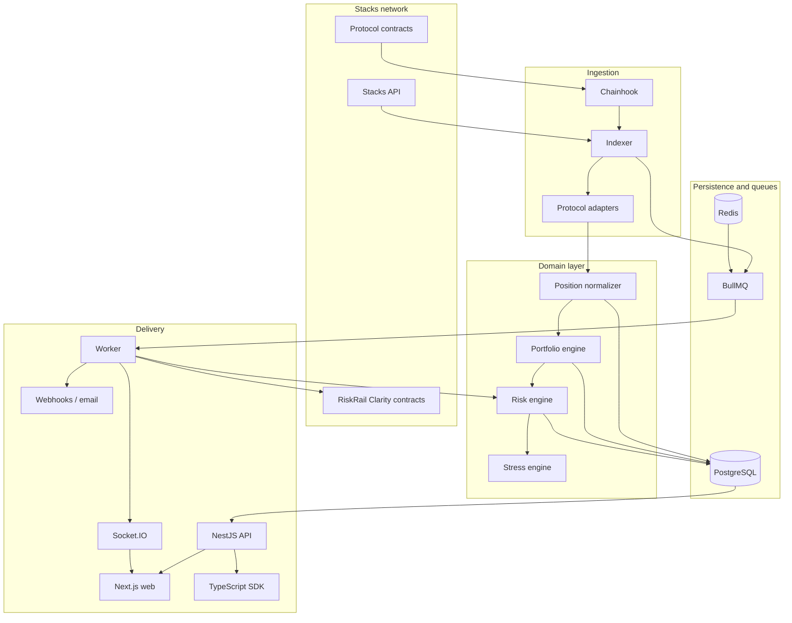
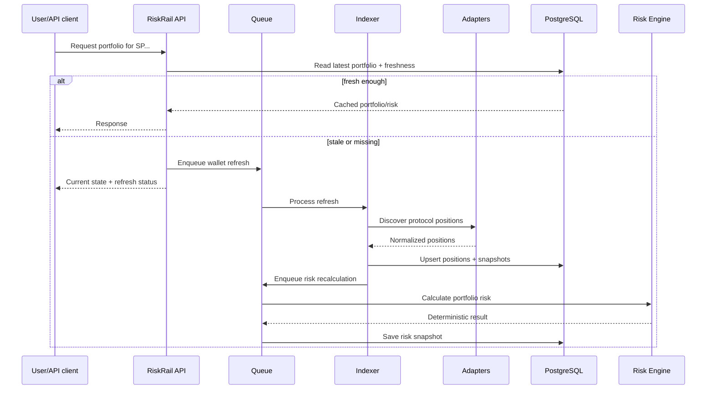
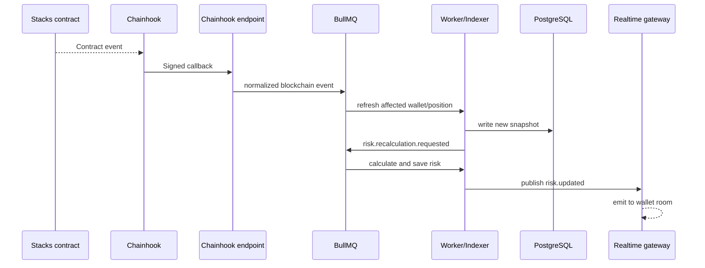
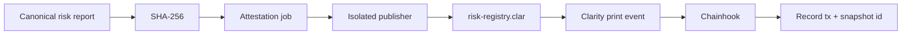

# System Architecture

## The architecture in one sentence

RiskRail is a modular TypeScript monorepo where indexing, protocol interpretation, portfolio aggregation, risk calculation, delivery and on-chain attestation are separate responsibilities connected by typed domain contracts and asynchronous events.

## High-level view

## Why the boundaries are arranged this way

The easiest way for a blockchain analytics project to become hard to maintain is to let chain calls, protocol parsing, business rules and API formatting leak into the same files.

RiskRail avoids that by using a few firm boundaries.

### The indexer understands the chain, not risk

The indexer knows how to fetch blocks, balances, transactions and contract events. It knows when something changed and which wallet or protocol needs to be refreshed.

It should not decide whether 44% protocol concentration is "high." That belongs to the risk layer.

### Adapters understand protocols, not the application

An adapter knows how BitPay represents a stream or how a lending protocol represents collateral. It converts that protocol-native representation into `NormalizedPosition`.

The adapter should not send email, create API responses or render UI labels.

### The portfolio engine understands positions, not protocols

Once a position is normalized, the portfolio engine should not need a BitPay-specific branch. It aggregates values and exposures from a shared model.

### The risk engine is a pure calculation library

The risk engine accepts explicit inputs and returns explicit outputs. It does not query Prisma, call Hiro, send transactions or read environment variables.

That purity matters because risk logic needs exact unit tests and should be reusable from the API, worker and simulation code.

### The API is a delivery boundary

The API validates requests, applies auth/rate limits, loads domain data and returns versioned responses. It should not become the only place where business logic exists.

### Workers own asynchronous side effects

Publishing an attestation, delivering a webhook, evaluating thousands of alert rules or retrying a failed upstream operation are worker jobs rather than long-running HTTP requests.

## Main data path

A normal wallet refresh looks like this:

The exact HTTP behavior can evolve, but the important point is that a slow upstream chain query should not force every client request to wait synchronously.

## Event-driven updates

Chainhook gives us a second path. Instead of waiting for a user to request a refresh, an event from a supported contract can tell us that a known position changed.

## Smart-contract path

RiskRail does not publish every calculation on-chain. An attestation is an explicit side effect that can run when the snapshot is meaningful enough to preserve.

This is intentionally one-way. The reporting system can survive a temporary failure to publish on-chain; the database remains the working source for rich reports while the contract is the verifiable anchor.

## Deployment shape

The repository has five deployable application processes:

- `web`;
- `api`;
- `indexer`;
- `worker`;
- `realtime`.

The packages under `packages/` are libraries, not separately deployed services.

This gives us enough isolation to scale the indexer and worker independently without turning every module into its own network service.
