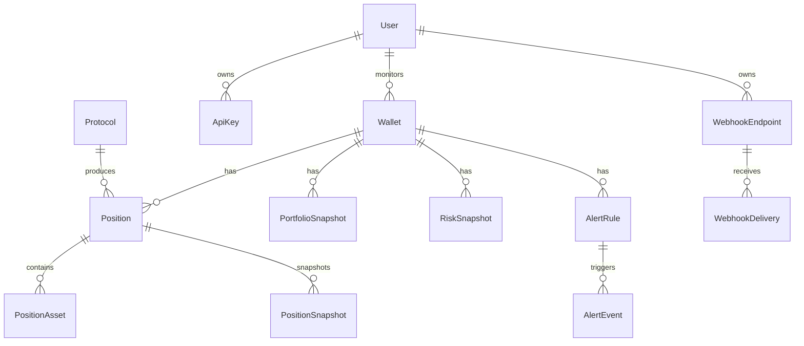

# Data Model

The Prisma schema is designed around history, not only current state. That is important because a risk product needs to answer both "what is the position now?" and "what did Rivisk know when it produced this earlier snapshot?"

## Core relationships

## `User`

A Rivisk account. Public address analysis does not require a user row, so wallets can exist without a user association.

A user owns developer API keys and webhook endpoints.

## `Wallet`

Represents a Stacks principal being monitored.

Important fields:

- unique address;
- optional user relation;
- `lastIndexedAt` freshness marker;
- positions;
- portfolio/risk snapshots;
- alert rules.

One future improvement is to distinguish an address from a logical portfolio containing several addresses. The current grant scope keeps one Stacks address as the portfolio root.

## `Protocol`

Application-level protocol metadata:

- stable id such as `bitpay`;
- human name;
- protocol type;
- enabled state;
- adapter version;
- contract ids.

The database record is operational metadata. The Clarity `protocol-registry` can provide a canonical on-chain reference for supported contract principals and adapter metadata hashes.

## `Position`

The latest known normalized representation of a protocol position.

The row deliberately contains both structured columns and `raw` JSON:

- structured values are used for indexing/querying;
- `raw` preserves adapter-specific context useful for debugging and reprocessing.

`exact` is important. Rivisk should distinguish a value read directly from reliable chain state from one reconstructed or estimated from incomplete data.

## `PositionAsset`

A position can contain several assets with different roles:

- asset;
- collateral;
- debt;
- reward;
- locked.

Atomic token amounts are strings so large values stay exact. USD values use PostgreSQL decimal precision.

## `PositionSnapshot`

Historical copy of a position's value/state at a source block and observation time.

We keep snapshots because overwriting a position would make it impossible to audit an older risk report.

## `PortfolioSnapshot`

Historical portfolio aggregate. It currently stores total value and protocol values with a source block.

As the product grows, this model may gain explicit valuation coverage fields so we can say, for example, "82% of discovered assets had reliable USD pricing at this snapshot."

## `RiskSnapshot`

A persisted summary of a Rivisk calculation.

Current fields include:

- risk score in basis points;
- optional health factor E4;
- optional liquidation distance basis points;
- protocol concentration basis points;
- liquidity score basis points;
- report hash;
- source block;
- optional on-chain snapshot id;
- optional on-chain transaction id;
- observation time.

The full risk report should live in a report store or structured database model rather than trying to squeeze every detail into this row.

## `AlertRule` and `AlertEvent`

An alert rule stores:

- wallet;
- metric;
- operator;
- threshold;
- channel;
- status.

An alert event records what value actually crossed the rule and when.

This history prevents notification delivery from being the only evidence that an alert happened.

## `ApiKey`

Only a hashed representation of a developer API key should be stored. The full key is shown once at creation.

The `prefix` lets support/logging identify a key without exposing its secret.

## `WebhookEndpoint` and `WebhookDelivery`

Webhook endpoint records should store a hash/encrypted representation of secrets according to the signing design. Deliveries record status code, attempt count and delivery time so failures can be diagnosed and retried safely.

## `IndexedBlock`

A small but important operational table. It lets the indexer record which blocks have been processed and helps with idempotency/backfill logic.

For more advanced reorg handling, this model may need parent hash/canonical status rather than assuming every indexed block remains canonical.

## `AuditLog`

Records security/administrative actions such as API-key revocation, protocol configuration changes or publisher administration.

Audit logs should be append-only at the application level.

## Data we should not store

Rivisk should not store:

- user seed phrases;
- end-user private keys;
- raw wallet secrets;
- unnecessary personal data unrelated to the product;
- third-party access tokens in ordinary log output;
- service publisher secrets in PostgreSQL.

## Snapshot retention

During the grant phase, retaining all snapshots is simplest. If volume grows significantly, the retention policy can become tiered:

- dense recent snapshots;
- hourly/daily rollups for older history;
- immutable reports for snapshots that were published on-chain;
- configurable retention for raw upstream payloads.

## PolicyBreachEvent

On-chain policy breaches are stored separately from ordinary `AlertEvent` rows because they come from wallet-owned Clarity policy state rather than a locally-created alert rule. A policy breach records the wallet, metric, comparison operator, threshold, observed value, source block, copied policy metadata and trigger time.

Keeping the two event types separate makes it easy to answer two different questions later: "which rules did the Rivisk account configure?" and "which rules did the wallet itself commit on-chain?"
