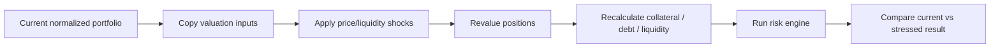

# Stress Testing

Stress testing is one of the clearest ways to turn raw portfolio data into something useful. It answers a simple question: "what would these positions look like if one or more market inputs moved?"

It is a simulation, not a prediction.

## Supported scenarios

The current engine includes four built-in presets:

```text
BTC -10%
BTC -20%
BTC -30%
STX -20%
```

Users can also build a custom multi-asset scenario such as:

```json
{
  "BTC": -1700,
  "STX": -1200
}
```

where changes are expressed in basis points.

## Scenario pipeline



The current portfolio should never be mutated by a simulation.

## Why a simple price multiplier is not enough

If a user has a lending position, reducing the displayed value of BTC by 20% is only the first step. RiskRail also needs to recompute the protocol-specific collateral relationship.

For a position with BTC-linked collateral and stable debt, a BTC drop can lower collateral value while debt stays roughly unchanged. That can move the health factor substantially.

For a liquidity position, a price shock can also change pool composition or exit conditions. The exact simulation depth will depend on the protocol adapter.

## Scenario result

A useful response should contain:

- scenario definition;
- baseline source block;
- baseline portfolio/risk metrics;
- stressed metrics;
- absolute and percentage differences;
- positions materially affected;
- assumptions;
- warnings for unsupported calculations.

Example shape:

```json
{
  "scenario": { "BTC": -2000 },
  "baseline": {
    "portfolioValueUsd": "31000.00",
    "healthFactorE4": 14700
  },
  "stressed": {
    "portfolioValueUsd": "26200.00",
    "healthFactorE4": 12000
  },
  "warnings": []
}
```

## Custom shocks

The scenario engine should eventually support more than price:

- asset price change;
- liquidity reduction;
- protocol-specific collateral-factor change for what-if analysis;
- borrow-rate or debt-growth assumptions over a defined horizon;
- temporary loss of a price source;
- market depth deterioration.

The first version should keep the scenario model small enough to test thoroughly.

## Reproducibility

A stored simulation should identify:

- exact input portfolio snapshot;
- source block;
- price observations;
- scenario parameters;
- engine version;
- result.

That prevents a saved scenario from changing simply because today's market price is different.

## Current API implementation

The API exposes:

```text
GET  /api/v1/simulations/presets
POST /api/v1/simulations
```

Custom requests use an indexed wallet plus one or more shocks. For example:

```json
{
  "address": "SP...",
  "name": "BTC drawdown",
  "shocks": [
    { "symbol": "sBTC", "changeBps": -2000 }
  ]
}
```

The endpoint uses the latest persisted portfolio snapshot and returns its source block and valuation coverage. It does not automatically reindex the wallet first, which keeps the scenario tied to a known baseline.

The background risk worker also runs the default scenarios after every successful refresh and includes those results in the canonical `riskrail-v1.1` report before hashing.

See [32 — Zest V2 lending and stress engine](./32-zest-v2-lending-and-stress-engine.md) for the implementation details and current Zest pricing caveat.

## UI language

Prefer wording such as:

> Under a simulated 20% BTC decline, this position's health factor would move from 1.47 to approximately 1.20 using the current protocol parameters.

Avoid wording such as:

> BTC is likely to drop 20% and your position will be liquidated.

The simulator is a deterministic what-if tool, not a market forecast.
