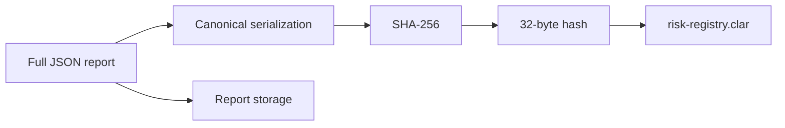
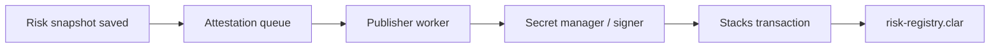

# On-Chain Risk Attestations

## What an attestation means

A RiskRail attestation means:

> At a specific source block, RiskRail produced a specific risk report for a wallet using a known engine/methodology version, and the hash of that report matches the hash stored in the RiskRail registry contract.

It does **not** mean:

- the future is guaranteed;
- the portfolio cannot change in the next block;
- the user is financially safe;
- every protocol has been audited by RiskRail;
- the report is useful forever.

This distinction should be visible in product documentation.

## Why store a hash instead of the whole report

A complete report may contain dozens of positions, prices, source metadata, warnings and scenario results. Writing all of that into Clarity state would be expensive and awkward.

Instead:

1. build the report off-chain;
2. canonicalize it;
3. hash the exact canonical bytes with SHA-256;
4. store the 32-byte hash plus compact summary metrics on-chain;
5. keep the full report in durable off-chain storage.



## Canonicalization matters

Normal JSON serialization is not enough for a verifiable hash because key order and number formatting can differ.

RiskRail needs a documented canonical serialization rule. One reasonable approach is a JSON canonicalization scheme with:

- deterministic key ordering;
- UTF-8 encoding;
- decimal values represented as strings;
- no insignificant whitespace;
- explicit schema version.

Whatever algorithm is chosen must be shared by the publisher and verifier.

## Proposed report envelope

```json
{
  "schemaVersion": "1",
  "engineVersion": "0.1.0",
  "methodologyVersion": "2026-01",
  "wallet": "SP...",
  "network": "testnet",
  "sourceBlock": 123456,
  "observedAt": "...",
  "positions": [],
  "prices": [],
  "metrics": {},
  "scenarios": [],
  "warnings": []
}
```

The final schema should be versioned before public integrations depend on it.

## Publication policy

Publishing every small update is unnecessary. A practical policy may publish when:

- a user explicitly requests an attestation;
- a material risk threshold changes;
- a scheduled periodic snapshot is due;
- a treasury/integration plan requests a signed cadence.

The grant demo can start with explicit or periodic publication.

## Publisher isolation

The publication path should look like this:



The public API process should not have the service private key merely because it needs to serve HTTP requests.

## Verification flow

A user or external tool should be able to:

1. retrieve a report by id/hash;
2. canonicalize it using the documented algorithm;
3. calculate SHA-256;
4. read the snapshot from the Clarity contract;
5. compare hashes;
6. check source block and publication freshness.

The dashboard can expose a "Verify" action that performs this flow in the browser or backend and shows each step.

## Freshness

A correct old report is still old.

`risk-registry.clar` stores `published-at` and supports `is-snapshot-fresh(wallet, max-age-blocks)`.

Consumers should choose a freshness requirement appropriate to their use case instead of treating the latest snapshot as current forever.

## Trust model

An attestation proves integrity of a RiskRail-produced report relative to the on-chain hash. It does not eliminate trust in:

- RiskRail's adapter implementation;
- price/oracle sources;
- the risk methodology;
- the publisher key;
- protocol data quality.

That is why source metadata, open methodology and independent verification matter as much as the contract itself.
