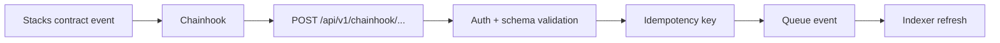

# Chainhook and Indexing

RiskRail needs both pull-based reads and event-driven indexing.

The Stacks API is useful for current balances and direct reads. Chainhook is useful when we know which contract events should trigger a refresh.

## Why not poll everything

Polling every monitored wallet and every supported contract at a very short interval wastes upstream capacity and still introduces delay.

A better model is:

- Chainhook tells us that something relevant happened;
- RiskRail determines which position/wallet is affected;
- the indexer performs authoritative reads as needed;
- a job recalculates the portfolio and risk.

Events are a trigger, not necessarily the final source of truth.

## Inbound callback path



The API callback should return quickly after durable enqueueing rather than performing a full risk calculation inside the webhook request.

## Authentication

The environment includes `CHAINHOOK_AUTH_TOKEN`. The callback handler should verify configured authentication before accepting events.

If the deployment supports stronger signature verification, prefer that over a static token.

Never write the token into logs.

## Idempotency

Blockchain/event callbacks can be delivered more than once. Every event should have an idempotency identity built from stable chain data such as transaction id, event index and block hash/height.

Processing the same event twice must not create duplicate position history or duplicate alerts.

## Reorg handling

The initial `IndexedBlock` model stores block height and hash. Before mainnet production, the indexer should have an explicit reorg policy.

Useful behaviors include:

- verify block hash for recently indexed heights;
- mark/rebuild snapshots derived from a non-canonical block;
- avoid publishing attestations for data that has not reached the chosen confirmation depth when that matters;
- make confirmation policy configurable by event type.

## Backfills

When a new adapter is added, RiskRail may need to discover existing positions rather than waiting for the next event.

Backfill jobs should be separate from live indexing so they can run at controlled concurrency and not starve realtime events.

## Indexer checkpoints

Operational data should include:

- current Stacks tip height;
- latest indexed height;
- lag in blocks;
- last successful upstream request;
- failed adapter reads;
- queue depth;
- backfill progress.

These are observability metrics, not just debug logs.

## Event to domain mapping

Raw Chainhook payloads should not flow throughout the codebase. Convert them into a small internal event such as:

```ts
{
  type: 'position.refresh.requested',
  wallet: 'SP...',
  protocolId: 'bitpay',
  source: {
    txId: '0x...',
    blockHeight: 123456,
    eventIndex: 2
  }
}
```

This keeps Chainhook's payload format at the integration edge.

## BitPay event example

A stream event can trigger a narrow refresh:

```text
stream-created
  -> identify sender/recipient
  -> re-read stream state
  -> upsert BitPay position
  -> recalculate affected portfolio(s)
  -> evaluate alerts
```

The same architecture should work for lending deposits, borrows, repayments and collateral changes once an external adapter is added.
