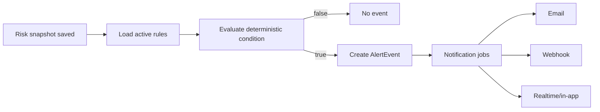

# Realtime Updates and Alerts

RiskRail has two different concepts that are easy to mix up:

- realtime delivery tells a connected client that new data exists;
- alerts evaluate a rule and decide that a threshold has been crossed.

They share events, but they are not the same subsystem.

## Realtime architecture

Socket.IO is used for dashboard updates.

Suggested rooms:

```text
wallet:{address}
portfolio:{address}
risk:{address}
protocol:{protocolId}
```

When a worker saves a new risk snapshot, it can publish a lightweight event to the realtime service:

```json
{
  "type": "risk.updated",
  "wallet": "SP...",
  "riskSnapshotId": "...",
  "sourceBlock": 123456
}
```

The browser then invalidates/refetches the relevant TanStack Query cache instead of receiving the full canonical report over a socket event.

## Alert rule model

An alert is made of:

- wallet;
- metric;
- operator;
- threshold;
- channel;
- active/paused state.

Examples:

```text
healthFactor < 1.30
protocolConcentrationBps > 5000
liquidityScoreBps < 4000
riskScoreBps > 7000
```

## Evaluation

Alert evaluation should happen after a new risk snapshot or relevant position update, not on a blind one-minute timer for every wallet.



## Avoiding notification spam

If health factor remains below 1.30 for 100 blocks, the user should not receive 100 identical alerts.

The alert system needs state such as:

- last triggered value/time;
- current condition true/false;
- cooldown period;
- re-arm rule when the condition returns to normal.

A useful default model is edge-triggered:

> Notify when a metric crosses from the non-trigger state into the trigger state. Re-arm after it crosses back.

Periodic reminders can be a separate feature.

## On-chain policies

`risk-policy.clar` stores a small user-owned policy. The worker can read that policy and evaluate it using the same deterministic snapshot.

The contract does not call email, Slack, Telegram or webhooks. That delivery remains off-chain.

## Notification channels

MVP:

- in-app/realtime;
- email;
- developer webhook.

Later:

- Telegram;
- Discord;
- mobile push.

Adding a channel should not change risk calculation or alert rule semantics.

## Delivery reliability

Notifications should run as queue jobs with retry/backoff. Alert events are saved before delivery so an email provider outage does not erase the fact that the condition occurred.

## User language

Alerts should state the observed condition, source and freshness:

> Health factor for your Protocol X position moved from 1.36 to 1.28 at source block 123456. Your configured threshold is 1.30.

That is better than:

> Danger! Your Bitcoin is about to be liquidated!

RiskRail should stay factual and specific.
