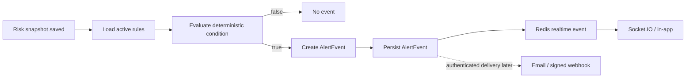

# Realtime Updates and Alerts

RiskRail has two different concepts that are easy to mix up:

- realtime delivery tells a connected client that new data exists;
- alerts evaluate a rule and decide that a threshold has been crossed.

They share events, but they are not the same subsystem.

## Realtime architecture

Socket.IO is used for dashboard updates.

The current beta keeps the room model deliberately small:

```text
portfolio:{address}
```

Portfolio, risk, local-alert and policy-breach events for the same address all use that room. We can split the room taxonomy later if protocol-level subscriptions become useful.

The indexer and workers publish lightweight events into the Redis `riskrail.realtime` channel. The Socket.IO service subscribes to that channel and forwards the message to the address room. A risk update looks like:

```json
{
  "event": "risk.updated",
  "address": "SP...",
  "data": {
    "riskSnapshotId": "...",
    "riskLevel": "moderate",
    "healthFactorE4": 14700
  },
  "timestamp": "..."
}
```

The browser then invalidates/refetches the relevant TanStack Query cache instead of receiving the full canonical report over a socket event.

## Alert rule model

An alert is made of:

- wallet;
- metric;
- operator;
- threshold;
- channel;
- active/paused state.

Examples:

```text
healthFactor < 1.30
protocolConcentrationBps > 5000
liquidityScoreBps < 4000
riskScoreBps > 7000
```

## Evaluation

Alert evaluation happens after a new risk snapshot, not on a blind timer for every wallet. The risk worker queues an `alert.evaluate` job with the snapshot ID, so the alert decision is tied to an exact persisted risk state.



## Avoiding notification spam

If health factor remains below 1.30 for 100 blocks, the user should not receive 100 identical alerts.

The current implementation compares the new snapshot with the previous snapshot. That gives us an edge-trigger without needing to send repeat events while a metric remains on the wrong side of the threshold.

The rule is:

> Notify when a metric crosses from the non-trigger state into the trigger state. Re-arm after it crosses back.

Periodic reminders can be a separate feature.

## On-chain policies

`risk-policy.clar` stores a small user-owned policy. The worker can read that policy and evaluate it using the same deterministic snapshot.

The contract does not call email, Slack, Telegram or webhooks. That delivery remains off-chain.

## Notification channels

Current beta:

- in-app/realtime.

Planned after wallet/account authentication:

- email;
- signed developer webhook.

Later:

- Telegram;
- Discord;
- mobile push.

Adding a channel should not change risk calculation or alert rule semantics.

## Delivery reliability

Alert evaluation already runs as a BullMQ job and persists the event before realtime delivery. Email and webhook delivery should follow the same rule when they are added: persistence first, delivery second, with retry/backoff around the external provider.

## User language

Alerts should state the observed condition, source and freshness:

> Health factor for your Protocol X position moved from 1.36 to 1.28 at source block 123456. Your configured threshold is 1.30.

That is better than:

> Danger! Your Bitcoin is about to be liquidated!

RiskRail should stay factual and specific.


## Current event sources

The realtime channel currently carries four event names:

- `portfolio.updated` from the indexer after a portfolio snapshot is persisted;
- `risk.updated` from the risk worker after a risk snapshot is persisted;
- `alert.triggered` when a local alert crosses into a breach;
- `policy.breached` when a configured on-chain policy crosses into a breach.

The browser uses these events as invalidation signals. It refetches the API rather than trusting socket payloads as the canonical financial state.
